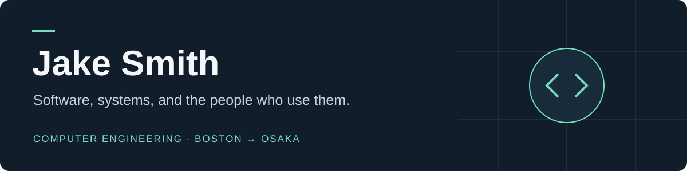

**Computer Engineering at Ritsumeikan University · Boston → Osaka**

[LinkedIn](https://www.linkedin.com/in/jake-smith-japan) · [Email](mailto:jakesmith1447@gmail.com)

I build software, talk to the people who might use it, and work with teams to turn those conversations into working prototypes. My projects span computer vision, AI-assisted workflows, and practical web applications.

## Selected projects

### 01 · [Oxford Venture Hackathon — 1st Place](https://github.com/Jsmitty78/Pathway-Oxford1stPlaceHackathon)

**Pathway · A 36-hour team build in Oxford**

Four teammates met at the event and built a smartphone-based walking-frame prototype. We conducted 32 street interviews, improvised a frame from lacrosse sticks, borrowed a 3D printer overnight, and demonstrated a simulated fall triggering a real call to our team's phone.

**My role:** concept and user research lead, product direction, validation, and pitching. Built with Caleb Byrne, Antony He, and Aiyush Gupta.

**Inside the repository:** the surviving Python detector, original event photos and footage, and a reconstructed JavaScript browser demo. The documentation clearly separates original work from the later reconstruction.

[Read the build story](https://github.com/Jsmitty78/Pathway-Oxford1stPlaceHackathon/blob/main/docs/HACKATHON_STORY.md) · [Explore the code](https://github.com/Jsmitty78/Pathway-Oxford1stPlaceHackathon/tree/main/src) · [Watch the original demos](https://github.com/Jsmitty78/Pathway-Oxford1stPlaceHackathon#original-hackathon-footage)

### 02 · [Sprink — 2nd Place, Recruit Holdings / Indeed Innovation Cup](projects/sprink.md)

**San Francisco · From field interviews to a working prototype in 48 hours**

An assistant for sprinkler fitters: ask a field question, inspect its supporting reference, and work toward a reviewable next step. Built with Yu, with continued development after the competition.

**My work:** customer interviews, product direction and pitching; later contributions to mobile Ask UX, reviewed voice input, source context, request cancellation, and failure handling.

**Engineering:** React, TypeScript, Hono/Node, SQLite, tool-based AI workflows, explicit verification, and human confirmation.

[Read the case study and code excerpt](projects/sprink.md)

### 03 · [Hospital Finder / CarePath Navigator](projects/hospital-finder.md)

**PBL3 · Project management, frontend development, and system design**

A hospital comparison interface that brings distance, estimated waiting time, language, and specialty into one decision. I led the class project team, built much of the frontend, and contributed to backend work and architecture planning.

**Engineering:** React, TypeScript, TanStack, Leaflet maps, weighted ranking, and clear treatment of uncertain estimates. The portfolio interface uses seeded data; the case study distinguishes it from the broader proposed backend.

[Read the technical case study](projects/hospital-finder.md)

### 04 · [MemoryPath](projects/memorypath.md)

**Transpose Platform AI Hackathon, Kansai · Human-in-the-loop AI**

A dementia-care handoff prototype where AI proposes updates with supporting evidence, and a person reviews them before approval.

**My role:** frontend work, fieldwork, user interviews, and product/workflow design with Yu. The repository also documents later technical development beyond the hackathon.

**Engineering:** Next.js, TypeScript, structured model output, Zod validation, evidence checks, and versioned approvals.

[Read the case study](projects/memorypath.md) · [Explore the code](https://github.com/Jsmitty78/MemoryPath)

### 05 · [Bridge — HR workflow prototype](projects/bridge.md)

**Kyushu University QREC Venture Life Challenge · Fukuoka**

A project exploring how HR could find missing context across workplace conversations and prepare better follow-up questions. I worked on product definition, prototype development, and feedback from HR and engineers.

**Engineering:** Next.js, TypeScript, typed API routes, rule-based detection, optional local-model analysis, IndexedDB, and bilingual interfaces.

[Read the anonymized case study](projects/bridge.md)

## How I work

- Start with interviews and a specific user workflow.
- Make interfaces and system boundaries understandable to the team.
- Keep AI suggestions reviewable, with explicit error and uncertainty states.
- Document what works, what is simulated, and what still needs testing.

I use AI-assisted development tools alongside code review, debugging, and testing. Team projects credit collaborators, and case studies distinguish my contribution from the team's work.

**Interested in software engineering, product engineering, and AI internship opportunities.**
