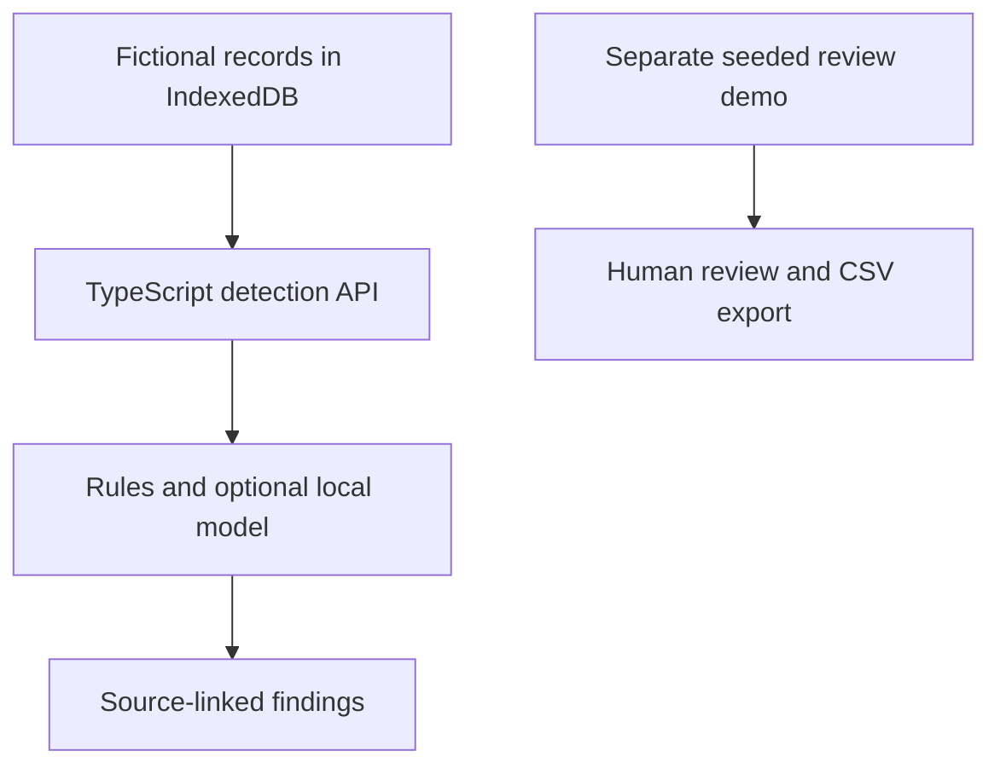

# People Bridge

**HR workflow prototype · Kyushu University QREC Venture Life Challenge**

Built while working with a Fukuoka-based host company. This case study omits the company's identity and internal records.

[Back to my profile](../README.md)

## The question

How could HR organize information scattered across workplace conversations and prepare clearer follow-up questions?

Our team explored a prototype that surfaces possible missing context and conflicting information for human review. The goal was to help someone investigate an issue, not to score employees or automate personnel decisions.

## My contribution

I worked on product direction, prototype implementation, and the technical demonstration. I helped translate research and feedback into a bilingual interface with source-linked findings and a review workflow. HR and engineering feedback informed the project; this was not a production rollout.

## Technical work

The prototype uses Next.js, React, and TypeScript. A detection screen stores fictional records in IndexedDB and sends bounded requests to a typed API. The API combines explicit rules with optional local Ollama analysis, then returns findings with evidence references and follow-up questions.

### Decisions that mattered

- **Bounded inputs and a timeout:** keep a malformed or slow request from making the demonstration unusable.
- **Deterministic fallback:** preserve a basic analysis path when the local model is unavailable.
- **Source references:** let a reviewer inspect the records behind a suggested issue.
- **Browser-local fictional data:** demonstrate the workflow without connecting to company systems.
- **Human review:** support follow-up and dismissal rather than treating a model output as a decision.

## What the prototype does and does not connect

The detection screen and the seeded review queue are separate demonstration flows. Detected findings do not automatically populate the review queue. The review interface supports state changes and CSV export; report sending is simulated.

Live workplace connectors, authentication, production delivery, and deployment governance are outside this prototype. Describing these boundaries is part of the engineering work.

## What I learned

An internal tool needs a clear place in an existing workflow. Useful questions, traceable evidence, and a familiar export can matter more than adding another dashboard.

The original source and company-linked demos are intentionally not linked from this case study. A public code edition would need a separate anonymization review covering files, assets, and history.
