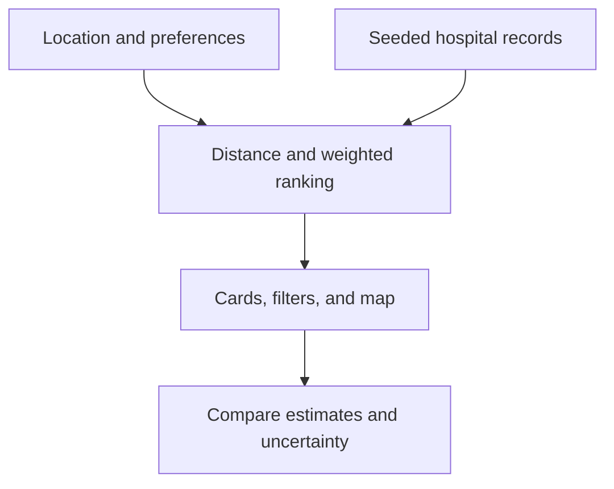

# Hospital Finder / CarePath Navigator

**PBL3 · Ritsumeikan University · Project management and software development**

[Back to my profile](../README.md)

## The problem

Choosing a hospital involves more than finding the nearest pin on a map. Our class project explored how distance, estimated waiting time, language support, and specialty could be compared in one interface. The team's research included 89 survey responses and healthcare-professional interviews.

## My role

I was project manager. I coordinated development, kept the team aligned on responsibilities, built much of the frontend, and contributed to backend work. I also worked on system architecture documentation, including state and sequence diagrams, and the final demonstration.

## From requirements to interface

The interface supports location selection, hospital filters, ranked results, and map-based comparison. Cards present estimated waits and uncertainty alongside the information needed to compare facilities.

The inspected portfolio snapshot uses React 19, TypeScript, TanStack Start/Router, Tailwind, Leaflet, and Recharts. Its hospital records and waiting-time predictions are seeded examples, and its hourly forecast is a deterministic demonstration curve. It does not call a live prediction service.

## Technical decisions

| Decision | Why it mattered |
|---|---|
| Separate hospital data and ranking logic from UI components | Ranking behavior can be inspected independently of map rendering. |
| Haversine distance with weighted preferences | Comparison can consider waiting time, congestion, language, and specialty as well as proximity. |
| Show estimate uncertainty | A forecast should not look like a guaranteed waiting time. |
| State and sequence diagrams | Team members could agree on user interactions and system responsibilities before integrating work. |

### Implementation map

- `src/lib/hospitals.ts`: sample records, distance calculations, ranking, and demo forecasts.
- `src/routes/index.tsx`: filtering and comparison workflow.
- `src/components/HospitalCard.tsx`: hospital information and uncertainty display.
- `src/components/LeafletMap.tsx`: interactive map.
- `src/components/LocationPicker.tsx`: location input.

The broader team design included a Flask service, relational database, and XGBoost waiting-time model. Those are distinct from the runnable frontend snapshot. The final project report includes model evaluation, but the training data, notebook, and model are not available here for reproduction.

## Team contributions

The repository records the following responsibilities. Development was collaborative, and these are not claims of exclusive authorship.

| Contributor | Documented responsibility |
|---|---|
| Jake Smith | Project management; state and sequence diagrams; frontend and backend contributions described above |
| Bien Alolod | Use-case and activity diagrams; documentation |
| Mahiro Ueda | Class diagram; documentation |
| Ibuki Yasuda | Component diagram; documentation |
| Sadia Islam | Website coordination |
| Daisuke Terauchi | Website coordination |
| Hanz Ranen | Website coordination |

## What I learned

Project management became concrete in the interfaces between people's work: agreeing on data shapes, assigning documentation responsibilities, and making the final workflow coherent. Clear architecture diagrams helped turn separate tasks into a shared implementation plan.

The source snapshot remains private. This public case study describes the work without exposing its private repository.
