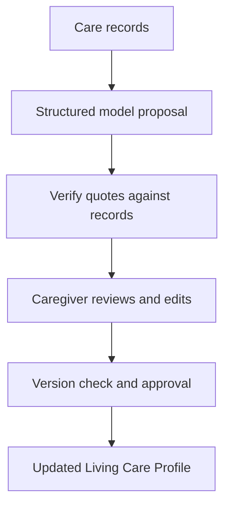

# MemoryPath

**Human-in-the-loop AI for care handoffs**

**YC Request for Startups concept · Transpose Platform AI Hackathon, Kansai**

[Back to my profile](../README.md) · [Source repository](https://github.com/Jsmitty78/MemoryPath)

## The project

MemoryPath turns SOAP notes (Subjective, Objective, Assessment, Plan), caregiver observations, and family memories into evidence-backed proposals for a dementia-care Living Care Profile. Nurses can inspect the cited records, edit proposed changes, and approve updates before they enter the profile.

I worked with Yu Yoshimuta on the project. My focus was frontend development, fieldwork, user interviews, and translating caregiver needs into the product workflow. The current repository also contains development beyond the original hackathon, so its full implementation should not be read as a claim about what was completed during the event.

## The hackathon

Built at **Transpose Platform × Ritsumeikan University × OUVC c0mpiled**, held in Kansai on July 5, 2026. The event featured **Garry Tan, CEO of Y Combinator**, with a talk and Q&A, followed by a five-hour build challenge based on **YC Request for Startups** themes.

The format brought startup problem selection and rapid AI prototyping into the same room. GStack and GBrain were introduced as tools for moving from a specification through design, implementation, and QA. Our concept focused that challenge on a practical question: how can a nurse find important changes across care notes without losing the evidence behind them?

[Official event and agenda](https://luma.com/compiled-4qzo)

*Prototype workspace. The repository uses synthetic data.*

## The review loop

## What is implemented

The current code uses Next.js, React, TypeScript, OpenAI structured output, and Zod. It checks proposed citations against the original record bodies and separates proposals from approved profile updates.

| Engineering detail | Source |
|---|---|
| Structured model response and schema validation | [profile-agent.ts](https://github.com/Jsmitty78/MemoryPath/blob/main/src/lib/profile-agent.ts) |
| Quote normalization and rejection of unsupported evidence | [verify.ts](https://github.com/Jsmitty78/MemoryPath/blob/main/src/lib/verify.ts) |
| Version checks before applying approved changes | [approve.ts](https://github.com/Jsmitty78/MemoryPath/blob/main/src/lib/approve.ts) |
| Editable proposal review | [ProposalReview.tsx](https://github.com/Jsmitty78/MemoryPath/blob/main/src/components/ProposalReview.tsx) |
| Supporting evidence in the interface | [EvidenceList.tsx](https://github.com/Jsmitty78/MemoryPath/blob/main/src/components/EvidenceList.tsx) |

The runtime uses a direct structured model call. It should not be described as a multi-agent system simply because an agent configuration also exists in the code.

## GStack, GBrain, and the care knowledge workflow

**GStack** was part of the event’s AI-assisted development tooling. **GBrain** is an optional retrieval backend in MemoryPath: care records are exported as Markdown, imported into a brain, and searched for context to support proposals. It is enabled with `CAREOS_MEMORY_BACKEND=gbrain`; the default workflow can run without it.

This explores the knowledge-graph approach to connected care information through GBrain. The application implements record retrieval and evidence-linked profile updates, rather than its own graph database or graph visualizer. SOAP notes are stored as record text, not automatically parsed into four clinical fields.

[Inspect the GBrain adapter](https://github.com/Jsmitty78/MemoryPath/blob/main/src/lib/gbrain.ts) · [Inspect the proposal workflow](https://github.com/Jsmitty78/MemoryPath/blob/main/src/lib/proposal.ts)

## What I took from it

Human review needs to be a working part of the product: visible evidence, editable proposals, and an explicit approval action. It cannot be added only as a sentence beneath an AI-generated answer.

This is a prototype with synthetic records and local persistence, not a deployed clinical system. Authentication and production safeguards would need additional work.
