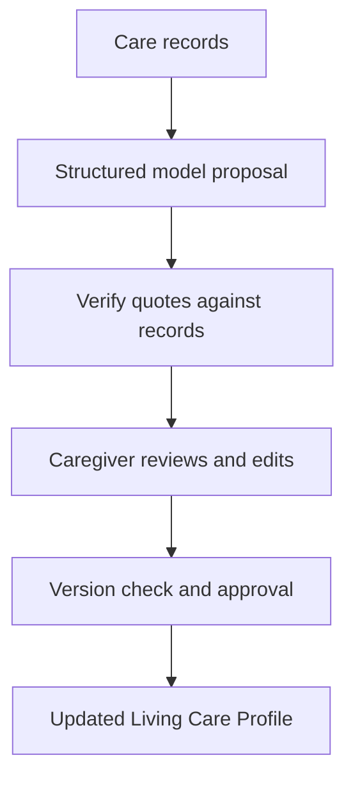

# MemoryPath

**Human-in-the-loop AI for care handoffs**

Transpose Platform AI Hackathon, Kansai · Exploring YC Request for Startups themes

[Back to my profile](../README.md) · [Source repository](https://github.com/Jsmitty78/MemoryPath)

## The project

Care notes can contain important changes without making them easy for the next caregiver to find. MemoryPath explores a Living Care Profile: AI proposes updates from records, includes supporting evidence, and leaves the final decision to a person.

I worked with Yu Yoshimuta on the project. My focus was frontend development, fieldwork, user interviews, and translating caregiver needs into the product workflow. The current repository also contains development beyond the original hackathon, so its full implementation should not be read as a claim about what was completed during the event.

The event was organized by Transpose Platform with university collaborators. Its use of YC themes does not imply that it was organized by Y Combinator.

*Prototype workspace. The repository uses synthetic data.*

## The review loop

## What is implemented

The current code uses Next.js, React, TypeScript, OpenAI structured output, and Zod. It checks proposed citations against the original record bodies and separates proposals from approved profile updates.

| Engineering detail | Source |
|---|---|
| Structured model response and schema validation | [profile-agent.ts](https://github.com/Jsmitty78/MemoryPath/blob/main/src/lib/profile-agent.ts) |
| Quote normalization and rejection of unsupported evidence | [verify.ts](https://github.com/Jsmitty78/MemoryPath/blob/main/src/lib/verify.ts) |
| Version checks before applying approved changes | [approve.ts](https://github.com/Jsmitty78/MemoryPath/blob/main/src/lib/approve.ts) |
| Editable proposal review | [ProposalReview.tsx](https://github.com/Jsmitty78/MemoryPath/blob/main/src/components/ProposalReview.tsx) |
| Supporting evidence in the interface | [EvidenceList.tsx](https://github.com/Jsmitty78/MemoryPath/blob/main/src/components/EvidenceList.tsx) |

The runtime uses a direct structured model call. It should not be described as a multi-agent system simply because an agent configuration also exists in the code.

## What I took from it

Human review needs to be a working part of the product: visible evidence, editable proposals, and an explicit approval action. It cannot be added only as a sentence beneath an AI-generated answer.

This is a prototype with synthetic records and local persistence, not a deployed clinical system. Authentication and production safeguards would need additional work.
