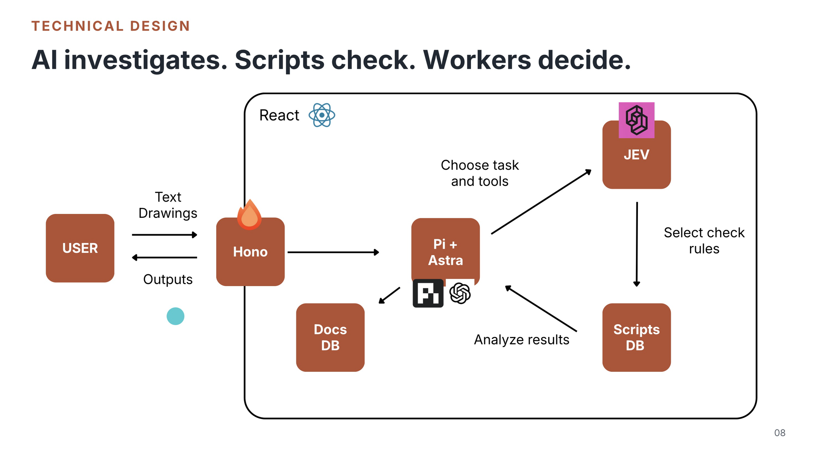
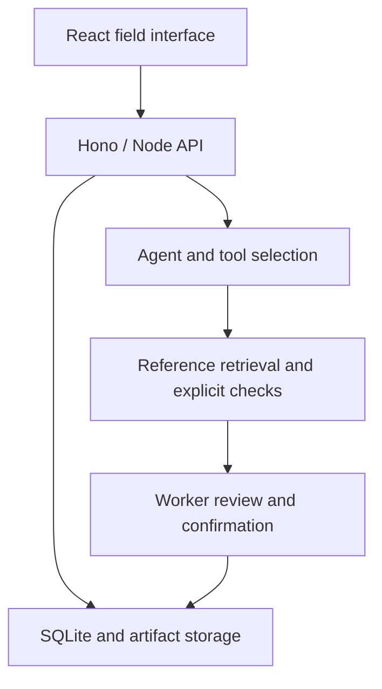
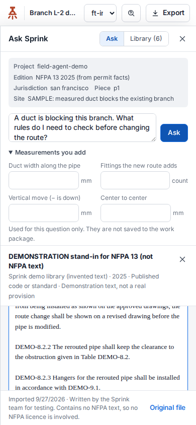

# Sprink

**2nd Place · $10,000 team Special Prize · Recruit Holdings / Indeed Innovation Cup · San Francisco**

**Yu Yoshimuta and Jake Smith · September 25–27, 2026**

Yu and I built Sprink during a 48-hour sprint and won a **$10,000 Special Prize as a team**, followed by continued product and engineering work.

[Back to my profile](../README.md)

## Start with the job site

We spoke with sprinkler fitters and a hotel maintenance engineer about their work. Three needs shaped the prototype: finding the relevant rule, preparing the materials for a task, and reconsidering a plan when an obstruction changes the job.

The product became Sprink: a field question leads to evidence and a possible next step that the worker can inspect. The pitch deck records an early paid test with three subscriptions at $20 per month. That was an initial purchase, not evidence of retention or measured productivity gains.

## The build story

| Stage | What we worked on |
|---|---|
| Discovery | Field interviews and narrowing the workflow around a fitter's next task |
| Competition build | Reference search, materials preparation, and a site-change demonstration |
| Presentation | A working prototype and a pitch connecting the implementation to field feedback |
| After the event | Mobile Ask interactions, reviewed voice entry, source context, cancellation, and clearer failure states |

The later improvements are separate from the original 48-hour competition build.

## Judges and feedback

**Jim Giles, CTO of Indeed**, gave us valuable technical feedback. **Robert Hohman, co-founder and former CEO of Glassdoor**, shared business advice on taking Sprink further. We also received feedback from **Damien Contreras of Google Cloud** and **Ho Joon Cha of OpenAI**.

Presenting to the four judges gave us a chance to discuss both the implementation and the business behind it. Their feedback was part of the event, not a product endorsement.

[Event and published award categories](https://innovation-cup2026.devpost.com/) · [My account of the event](https://www.linkedin.com/in/jake-smith-japan)

## My contribution

I worked on customer discovery, product direction, workflow design, validation, pitching, and product development. My later repository contributions include the mobile Ask interface, browser dictation and its tests, bounded API requests, and provider-error handling.

Yu Yoshimuta contributed substantial core integration, planning, and workflow engineering. The architecture below describes our team system. Some of my development used AI-assisted tooling, with coauthor credit retained in the source history.

## How the system fits together



*Architecture slide from our pitch deck. Docs DB denotes the source library; Scripts DB denotes the rule catalog.*



The pitch describes this boundary as: **LLM investigates. Scripts check. Workers decide.** Natural-language investigation, source retrieval, deterministic checks, and human approval have different responsibilities. Not every judging/checking capability described in the pitch was implemented during the event.

## Engineering details worth opening

| Concern | Implementation |
|---|---|
| Voice input | Dictation fills an editable question. The user reviews it before submitting. Permission denial, no speech, and unsupported browsers receive distinct states. |
| Network requests | Bounded requests, cancellation, and explicit failures keep the UI from waiting indefinitely or presenting provider failures as useful answers. |
| Evidence | Source cards show document context and provenance, with display restrictions respected. |
| Stale results | Revision checks prevent outdated input/results from being adopted for a newer job state. |
| Human decisions | Measurements and proposed route changes require explicit confirmation. |

## Visual storyboard



*Mobile Ask demonstration. The visible reference is an invented stand-in, not real NFPA guidance.*

Event and fieldwork photographs will be added when available. The story will connect the interviews, build, and final presentation. UI captures and the architecture image are documented in [media notes](../assets/sprink-media.md).

## A small example from my engineering work

The browser dictation controller maps errors into explicit interface states. A user denying microphone access needs a different recovery path from someone cancelling or speaking without recognition.

```typescript
export function statusForError(code: string): DictationStatus {
  switch (code) {
    case "not-allowed": return "denied";
    case "no-speech": return "no_speech";
    case "service-not-allowed": case "network": case "language-not-supported":
      return "unavailable";
    case "aborted": return "cancelled";
    default: return "failed";
  }
}
```

[Open the typed source excerpt](sprink-speech-example.ts). Selected from `sprink/apps/web/src/workbench/ask/speech.ts`, introduced in my dictation contribution with AI coauthor credit. The excerpt is not the full controller; listening, review, submission, and cleanup are separate responsibilities.

## What I learned

A useful field interface has to work when the answer is unavailable, the microphone is blocked, or the user changes their question. Making those states understandable became as important as getting a successful response.

The next evaluation is repeated field use: whether workers can verify a source, recover from an error, and reach the right next step. The prototype is not a substitute for professional code review.

## Source and scope

This case study is based on the Innovation Cup repository, subsequent implementation work, and our Sprink pitch deck. The implementation repositories remain private because they contain reference material and collaborative work. Selected code can be shown here without distributing the entire reference library.
